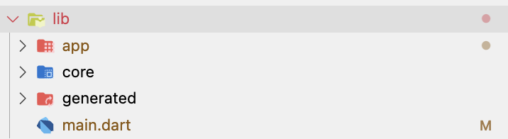
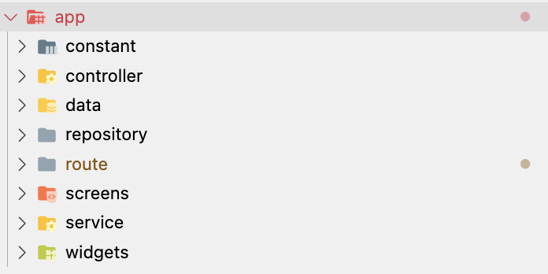

# ui_test_cengizhanparlak

## Requirements

Business Requirements.

User Story 1: As a customer, I want to view a list of most popular news articles for the last 7 Days. Acceptance Criteria:

- [X] The list should include the title of the article, a short snippet of the article and an image related to the article
- [X] The list should show only the first page of results (*API returns 20 at max and there is no pagination so all the results are included in the first page*)
- [X] The list should be sorted based on published dates (*Both ascending and descending order provided*)

User Story 2: As a customer, I want to select a news article and view more details. Acceptance Criteria:

- [X] The article detail page should include the article title, the publish date of the article, an image related to the article, the full text of the article (*as well as an option to read HTML representation provided*)
- [X] The article should open within the application and not on an external link (*opens up internally*)

- [X] WebViews are not allowed **in** this exercise. (*No WebViews used*)

## Running the Code

To run the code, first clone the repository and then run:

```bash
flutter pub get && flutter run
```

## Tests

Tests that are included in the project:

- [X] Repository/Data implementation tests
  - [X] Most Popular endpoint tests
  - [X] Article Detail endpoint tests
- [X] Widget/UI tests
  - [X] if Article List is displayed as expected
  - [X] if Error Text is displayed as expected
  - [X] if Refresh Button triggers the refresh function

To run tests, run:

```bash
flutter test
```

## UI Approach

MVVM architecture is used in the project. That said, most of the business logic is handled in the view model layer. The view layer is only responsible for displaying the data that is provided by the view model. The view model layer is also responsible for handling the API calls and parsing the data.

## Used Packages

- flutter_riverpod: to handle state management
- cached_network_image: to cache article images
- easy_localization: to localize the app
- either_dart: to handle api errors
- equatable: to compare objects
- flutter_html: to display html content
- go_router: to handle navigation
- google_fonts: to use custom fonts
- http: to make api calls
- mocktail: to mock api calls

## Folder Structure



- app/: Project related codes
  - 
  - constant/: Constant values; like api urls, api keys, app name, colors, paddings, etc.
  - controller/: Controllers to change the state of the app; like theme controller, localization controller, etc.
  - data/: data and model related codes
    - data_source/
    - enums/
    - models/
  - repository/: Repository layer to handle api calls and parsing the data
  - routes/: Routes to navigate between pages
  - screens/: Screens that are used in the app. Splitted based on the mix of feature and screen
  - services/: Services used in the app; mostly api services used in the repository layer
  - widgets/: Widgets used in the app
- core/: Core codes used in the project and can be used in any other project
  - utils/: Utility functions and extension
  - widgets/: Core widgets that are used in the project
- generated/: Generated files
